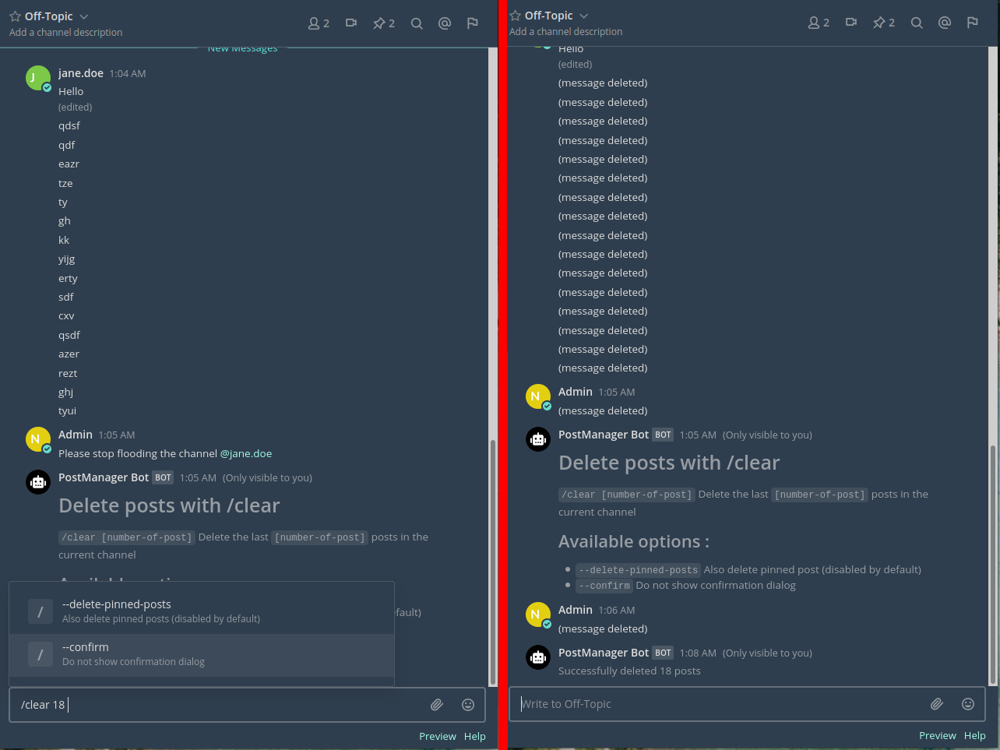

# Plugin PostManager (Beta) 

[](https://circleci.com/gh/nathanaelhoun/mattermost-plugin-postmanager)

This [mattermost](https://mattermost.org) plugin allow to manage posts with commands.



**Supported Mattermost Server Versions: 5.2+** (command autocomplete with Mattermost 5.24+)

## Features

#### Manage posts with commands
Available commands :
  - `/postmanage delete [number-of-post]` 	Delete posts in the channel
  - `/postmanage help` 										  Display command usage

#### Use aliases
You can toggle theses aliases in **System Console > Plugins > PostManager**
  - `/clear` is an alias for `/postmanage delete`

## Installation

1. Go to the [releases page of this Github repository](https://github.com/nathanaelhoun/mattermost-plugin-postmanager/releases) and download the latest release for your Mattermost server.
2. Upload this file in the Mattermost System Console under **System Console > Plugins > Management** to install the plugin. To learn more about how to upload a plugin, [see the documentation](https://docs.mattermost.com/administration/plugins.html#plugin-uploads).
3. Activate the plugin at **System Console > Plugins > Management**.


## Contribution

Feel free to [file an issue](https://github.com/nathanaelhoun/mattermost-plugin-postmanager/issues/new/choose) to submit possible improvements. PR are also welcomed!

## Development

To avoid having to manually install your plugin, build and deploy your plugin with login credentials:
```
export MM_SERVICESETTINGS_SITEURL=http://localhost:8065
export MM_ADMIN_USERNAME=admin
export MM_ADMIN_PASSWORD=password
make deploy
```

or with a [personal access token](https://docs.mattermost.com/developer/personal-access-tokens.html):
```
export MM_SERVICESETTINGS_SITEURL=http://localhost:8065
export MM_ADMIN_TOKEN=j44acwd8obn78cdcx7koid4jkr
make deploy
```
