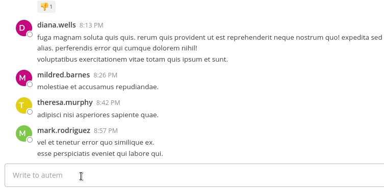

#  Plugin Broomer (Beta) [](https://circleci.com/gh/nathanaelhoun/mattermost-plugin-broomer)

Clean your channels with `/broom`!



**Supported Mattermost Server Versions: 5.24+**

## Features

`/broom last [number-of-post]` Delete the last `[number-of-post]` posts in the current channel

### Available options :

-   `--delete-pinned-posts true` Also delete pinned post (disabled by default)
-   `--confirm true` Skip confirmation dialog (can also be turned off for the whole server)

## Installation

1. Go to the [releases page of this Github repository](https://github.com/nathanaelhoun/mattermost-plugin-broomer/releases) and download the latest release for your Mattermost server.
2. Upload this file in the Mattermost System Console under **System Console > Plugins > Management** to install the plugin. To learn more about how to upload a plugin, [see the documentation](https://docs.mattermost.com/administration/plugins.html#plugin-uploads).
3. Activate the plugin at **System Console > Plugins > Management**.

## Contribution

Feel free to [file an issue](https://github.com/nathanaelhoun/mattermost-plugin-broomer/issues/new/choose) to submit possible improvements. PR are also welcomed!

## Development

To avoid having to manually install your plugin, build and deploy your plugin with login credentials:

```
export MM_SERVICESETTINGS_SITEURL=http://localhost:8065
export MM_ADMIN_USERNAME=admin
export MM_ADMIN_PASSWORD=password
make deploy
```

or with a [personal access token](https://docs.mattermost.com/developer/personal-access-tokens.html):

```
export MM_SERVICESETTINGS_SITEURL=http://localhost:8065
export MM_ADMIN_TOKEN=j44acwd8obn78cdcx7koid4jkr
make deploy
```

If your Mattermost server is running locally, you can enable [local mode](https://docs.mattermost.com/administration/mmctl-cli-tool.html#local-mode) to streamline deploying your plugin. Edit your server configuration as follows:

```
{
    "ServiceSettings": {
        ...
        "EnableLocalMode": true,
        "LocalModeSocketLocation": "/var/tmp/mattermost_local.socket"
    }
}
```

and then deploy your plugin:

```
make deploy
```

# Thanks to
- Icon made by [Freepik](https://www.flaticon.com/authors/freepik) from [www.flaticon.com](https://www.flaticon.com/)
- Mattermost for providing a good software and having a great community
